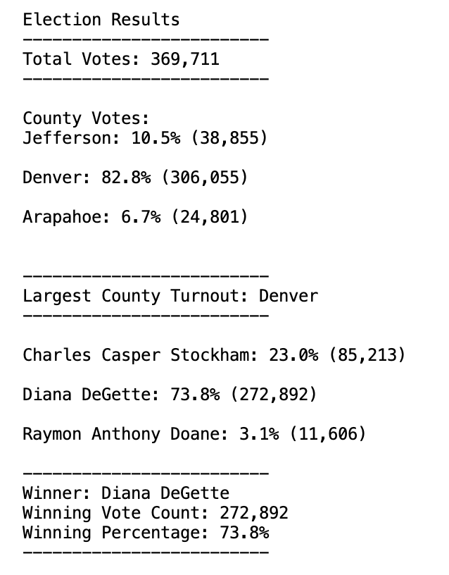
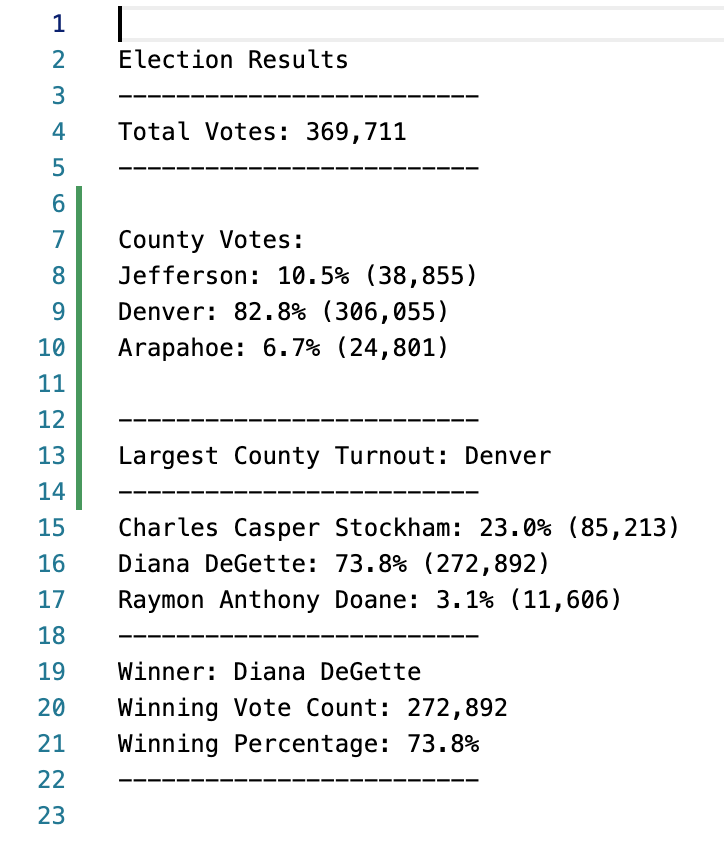

# An Analysis of the Election Results for Colorado Board of Elections

## Overview of Election Audit
The Colorado Board of Elections has assigned our client, Tom, to perform an audit on a recent election in the state. The purpose is to determine the winning candidate by most popular vote. The audit also requires the following information: 

* Total number of votes cast
* List of candidates
* Total number of votes received by each candidate
* Percentage of votes for each candidate
* Number and percentage of votes from each county
* Largest county turnout

Using Python, each of these requirements were met by printing this data to the command line and saving the data to a txt file. Click  for the script. For the election data, click . 

## Election Audit Results

As seen in both the text file and the command line output:

* Diana DeGette won by a large margin, with a total vote count of 272,892, which was 73.8% all of the votes
* Raymon Anthony Doane received the least votes at 3.1%
* Denver had the largest turnout at the election, making up 82.8% of the total votes
* Arapahoe had the lowest turnout, making up 6.7% of the total votes

## Election Audit Summary

Because the code is well-written, the Board of Elections of any state could use this script for their elections. The only necessary changes would be to the names of the csv files to be read or edited. Because lists and for-loops were used, the data could be from more than 3 counties and be composed of more than 3 candidates. Depending on the nature of the csv file, the enocding variable may have to be changed from its default when reading the file.

Political campaigns would have the greatest influence on elections by advertising in Denver County, where most of the voters live. This project could provide more insight by finding the percentage of votes for each candidate in each county. This additional data would show the political leanings of each county. Since we know the total votes for each county, it would also be helpful to know the total population of each county. That way, the Board of Elections could determine the political involvement of each county as well as the overall political involvement of the three counties combined. 
